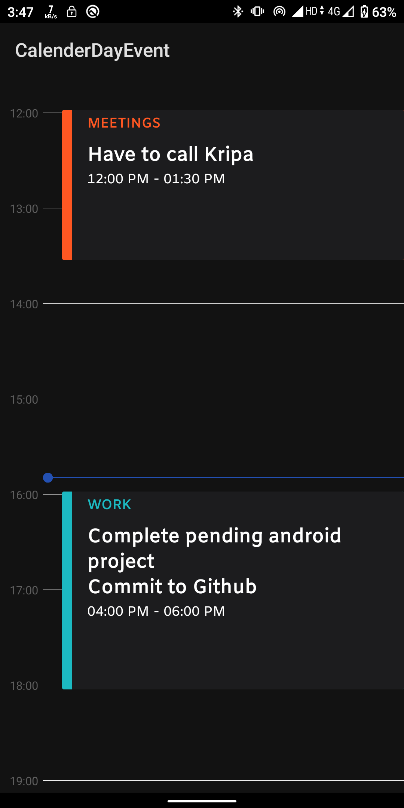

# CalendarDayEvent-Android
Day view of calendar and event can be added to any time of the day

## ScreenShot
[](https://jitpack.io/#mriduldk/CalendarDayEvent-Android)

<a></a>

# How to
To get a Git project into your build:

## Gradle
Step 1. Add the JitPack repository to your build file
Add it in your root build.gradle at the end of repositories:
````gradle
	allprojects {
		repositories {
			...
			maven { url 'https://jitpack.io' }
		}
	}
````
Step 2. Add the dependency
````Gradle
	dependencies {
	        implementation 'com.github.mriduldk:CalendarDayEvent-Android:0.1.0'
	}
````

## Maven
Step 1. Add the JitPack repository to your build file

	<repositories>
		<repository>
		    <id>jitpack.io</id>
		    <url>https://jitpack.io</url>
		</repository>
	</repositories>


Step 2. Add the dependency

	<dependency>
	    <groupId>com.github.mriduldk</groupId>
	    <artifactId>CalendarDayEvent-Android</artifactId>
	    <version>0.1.0</version>
	</dependency>
  
  
# Contribution
1. Overlapping ToDos are currently not available. You can contribute this feature.
2. If you've found an error, please file an issue.
